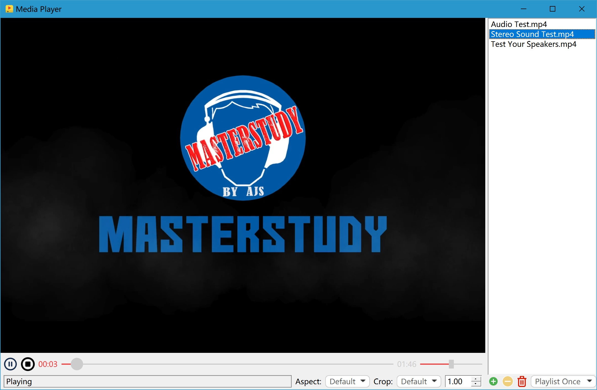

**Fork from [vlc-qt](https://github.com/vlc-qt/vlc-qt), but the changes are huge! I do not guarantee compatibility with original author's versions!**

**Fork自[vlc-qt](https://github.com/vlc-qt/vlc-qt)，但改动非常大！我不保证能够兼容原作者的版本！**
---

# VLC-Qt Library
VLC-Qt is a free library used to connect [Qt](http://qt.io) and [libVLC](http://videolan.org) libraries. It contains core classes for main media playback and also some GUI classes for faster media player development.

VLC-Qt runs on supported versions of Linux, macOS and Windows. It is developed in cross-platform spirit so it may work on other systems but is not supported.

## Qt/VLC versions
 - Qt only support Qt5+
 - libVLC only support 2.1+

Master branch is considered stable and working on all supported platforms.
All development is made in branches. You can also find specific releases by browsing tags.

## Examples
`Player` is a perfect example about how to use VLC-Qt in `tests` folder.

## Building and requirements
See [How to build VLC-Qt](BUILDING.md).
